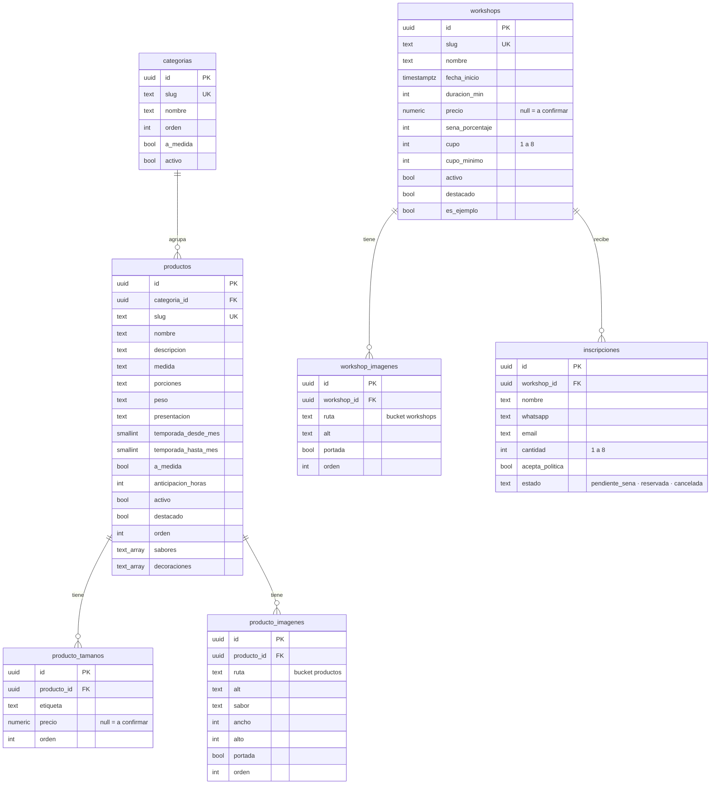

# Modelo de datos

El catálogo, los workshops y las inscripciones viven en Supabase (Postgres). El esquema está en [`supabase/migrations/0001_catalogo.sql`](../supabase/migrations/0001_catalogo.sql) y se corre una vez en el SQL Editor. Los datos se cargan con `npm run seed` (ver el [README](../README.md#supabase)).

## Diagrama

Todas las tablas tienen `created_at` y `updated_at`; un trigger (`set_updated_at`) actualiza `updated_at` en cada cambio.

**Decisiones del esquema:**

- **Precios `numeric(12,2)` nullables:** `null` significa "Precio a confirmar". Hoy todos los precios están en `null` hasta que Maggie los confirme.
- **Borrado en cascada solo para lo que depende del producto o del workshop** (tamaños e imágenes). Una categoría con productos y un workshop con inscripciones no se pueden borrar (`on delete restrict`): una inscripción es el registro de una persona y no tiene que desaparecer por accidente.
- **Temporada como dos meses (1 a 12):** el rango puede cruzar el año (septiembre → febrero). Un check obliga a cargar los dos meses o ninguno. La web calcula si el producto está en temporada con el mes de Buenos Aires (`lib/temporada.ts`).
- **`presentacion`** guarda la caja o el pack ("Caja de 12 unidades"), que en el catálogo se llama `unidades`.
- **Una sola portada por producto o workshop:** lo garantiza un índice único parcial (`where portada`).
- **`es_ejemplo`:** los workshops de `data/workshops.ts` se cargan con `es_ejemplo = true` hasta que Maggie pase los reales. La web los muestra con el aviso "Fecha de ejemplo: todavía no hay inscripción abierta", sin botón Reservar, y `crear_inscripcion` los rechaza. Los workshops que crean los tests (slug `e2e-…`) usan `es_ejemplo = false`.

## Permisos y RLS

RLS está activado en las siete tablas. Además, la migración revoca todos los privilegios de `anon` y `authenticated` y otorga solo `select` donde corresponde: los permisos de la tabla deciden qué operaciones existen y las políticas, qué filas se ven.

| Tabla | Política de lectura (anon, authenticated) | Escritura |
|---|---|---|
| `categorias` | Solo las activas (`activo`) | TODO(E5) |
| `productos` | Activos y de una categoría activa | TODO(E5) |
| `producto_tamanos` | Los de productos activos | TODO(E5) |
| `producto_imagenes` | Los de productos activos | TODO(E5) |
| `workshops` | Solo los activos | TODO(E5) |
| `workshop_imagenes` | Las de workshops activos | TODO(E5) |
| `inscripciones` | **Ninguna:** sin permisos ni políticas | Solo con `crear_inscripcion()` |

- **`workshops_publicos`** es una vista con `security_invoker = true`: corre con los permisos de quien consulta, así que respeta el RLS de `workshops` (solo activos). Además filtra los que ya empezaron y calcula `lugares_libres`.
- **`lugares_ocupados(workshop_id)`** es `security definer`: anon no puede leer `inscripciones`, así que la vista no podría sumar los lugares ocupados. La función solo devuelve el total de lugares, nunca datos de las personas.
- **`service_role` (la secret key)** se saltea RLS y la usan el seed y los tests. El proyecto tiene desactivado "Automatically expose new tables", así que la migración le otorga permisos explícitos (`grant all on all tables…`, `grant execute on all functions…`) y los mismos por defecto (`alter default privileges`) para lo que se cree después.
- **Storage:** los buckets `productos` y `workshops` son públicos, así que las fotos se sirven por URL sin pasar por RLS. No hay políticas de subida: solo la secret key puede subir. TODO(E5): políticas de subida para la admin.
- **Escritura desde el panel:** TODO(E5). La admin va a escribir con su sesión (`authenticated` con rol admin) y políticas específicas.

## Por qué la inscripción va por una función

Reservar un lugar son dos pasos: **mirar cuántos lugares quedan** y **guardar la inscripción**. Si se hacen por separado (por ejemplo, un `select` desde la API y después un `insert`), dos personas que se inscriben a la vez pueden leer los mismos lugares libres y entrar las dos:

| Momento | Persona A | Persona B |
|---|---|---|
| 1 | Lee: quedan 2 lugares | |
| 2 | | Lee: quedan 2 lugares |
| 3 | Guarda 2 lugares | |
| 4 | | Guarda 2 lugares → **4 lugares vendidos de 2** |

`crear_inscripcion(...)` hace los dos pasos dentro de **una sola transacción** en la base:

1. **Bloquea la fila del workshop** con `select … for update`. Si otra inscripción al mismo workshop está en curso, esta espera a que termine. Así, en el ejemplo, B lee los lugares recién después de que A guardó, y ve 0.
2. **Valida:** que el workshop exista, esté activo, no sea de ejemplo y no haya empezado (si no, `HB404`), y que alcancen los lugares (si no, `HB409`, con los lugares libres en `detail`).
3. **Inserta** la inscripción. Los checks de la tabla validan nombre, WhatsApp, email, cantidad (1 a 8) y aceptación de la política; si alguno falla, `23514`.

Es ACID:
- **Atómica:** o se guarda todo o nada.
- **Consistente:** los checks y el cupo se cumplen siempre.
- **Aislada:** el bloqueo atiende de a una las inscripciones a un mismo workshop.
- **Durable:** una vez confirmada, queda guardada.

El test `no sobrevende con inscripciones simultáneas` (`e2e/api.spec.ts`) manda diez inscripciones de 2 lugares a la vez a un workshop con cupo 3: entra una sola.

La función es `security definer` (corre con los permisos de su dueño) para poder insertar en `inscripciones`, que anon no puede tocar. Lleva `set search_path = ''` y nombra todo con su schema (`public.workshops`), para que nadie pueda colar una tabla o función con el mismo nombre en otro schema.

**Errores y cómo los traduce la API (`POST /api/inscripciones`):**

| Código | Cuándo | Respuesta |
|---|---|---|
| `HB404` | No existe, inactivo, de ejemplo o ya empezó | 404 |
| `HB409` | No alcanza el cupo (`detail` = lugares libres) | 409 con `spotsLeft` |
| `23514`, `22xxx` | No pasa un check de la tabla | 400 |
| Otro | Error inesperado | 500 (se registra solo el código, sin datos personales) |

### Decisión consciente: la función se puede ejecutar con la clave publishable

`crear_inscripcion` tiene `grant execute` para `anon`, así que cualquiera con la clave publishable puede llamarla directamente, sin pasar por el formulario. Esa clave es pública: viaja al navegador.

- **Riesgo:** alguien podría crear inscripciones falsas y ocupar el cupo de un workshop.
- **Mitigación hoy:**
  - Los checks de la tabla validan largo y formato de cada campo.
  - Una inscripción no puede pedir más de 8 lugares.
  - Los workshops de ejemplo no aceptan inscripciones.
  - El cupo es chico y Maggie confirma cada inscripción por WhatsApp con la seña.
- **Pendiente para el E5:** rate limit o captcha en el formulario, y que Maggie pueda cancelar inscripciones desde el panel (`estado = 'cancelada'` libera los lugares).

## Caché

Las páginas públicas (`/`, `/tienda`, `/tienda/[slug]` y `/workshops`) se regeneran cada 5 minutos (`export const revalidate = 300`). La inscripción lee los lugares libres en cada request. La API responde con `Cache-Control: public, s-maxage=300, stale-while-revalidate=600`; los errores llevan `no-store`. TODO(E5): revalidación on-demand cuando Maggie edite desde el panel.
